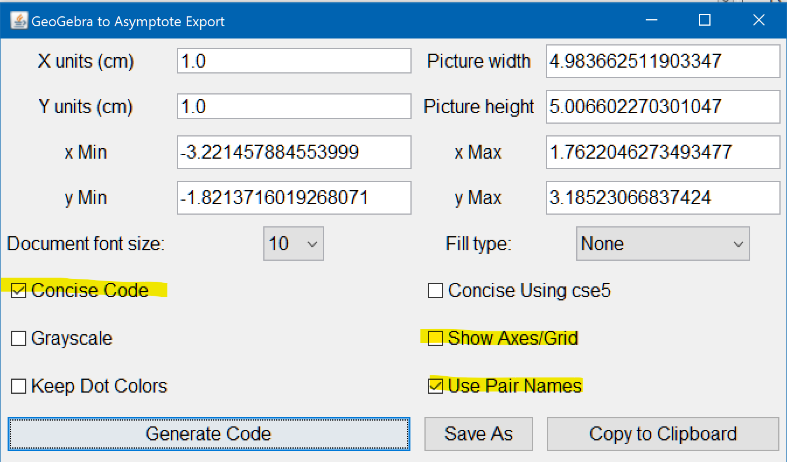

# Auxiliary Lines in Planar Geometry

This is a project initiated by Dr. Kai Zhu to translate this booklet on how to use auxiliary lines in planar geometry problems into English.

If you are interested in helping with the project, please read on.

## The Notebook

To work on the project, you can open the Jupyter Notebook, e.g. with [Google CoLab](https://colab.research.google.com/github/jameslao/Geometry/blob/main/Auxiliary%20Lines.ipynb) or your local [Jupyter Notebook](https://jupyter.readthedocs.io/en/latest/install.html) or [Jupyter Lab](https://jupyterlab.readthedocs.io/en/stable/getting_started/installation.html). If you need a separate hosted Jupyter environment, please contact the author.

## Git

The way Git works is that you fork this repository, update it, and raise a pull request so that the changes be merged backed into the main branch. A quick tutorial can be seen [here](https://guides.github.com/activities/hello-world/).

## Drawings

### What you need to do

The drawings are done with [Geogebra](https://www.geogebra.org/geometry), specifically, with GeoGebra Classic **5** (Download for [Windows](https://download.geogebra.org/installers/5.0/GeoGebra-Windows-Installer-5-0-625-0.exe) | [Mac](https://download.geogebra.org/package/mac)), which offers much greater control over exports than its successor 6 does. To make sure the sizes are consistent in the final output, *the width of the drawings should be ~**3-4 units*** (This can be tricky to see if you use the web version of GeoGebra, but open the properties panel and you'll figure out). Please download the .ggb file from Geogebra and put it in the figures folder.

The *line width*s are set to **2**, *point size*s to **1**, and all colors to **Black**. To change the default settings in GeoGebra Classic 5, go to menu Options - Advanced - Defaults (4th button on the toolbar) and update all the entries there. To avoid showing labels for all the line segments, goto menu Options - Labeling - New points only. Remember to save settings (Options - Save Settings).

Please upload / commit the .ggb files.

### What happens afterwards

The drawings are then exported to [Asymptote](https://asymptote.sourceforge.io/), which can only be done with GeoGebra Classic. 

Make sure you check the options (highlighted) as follows. Unfortunately I don't know how to save these options as default.

The handling of image size in GeoGebra is pretty peculiar. The graphic elements always uses absolute coordinates in .asy, but the size of the image is related to the zooming on the screen. To make sure the output is consistent, modify the `size(xxxx cm);` in the generated code to `size(6cm);` 

With the .asy file ready, we can convert it into PDF and SVG with Asymptote:

    asy -f pdf fig1.asy
    asy -f svg fig1.asy
    
*Et voilà*．You can insert the .svg file into the notebook.