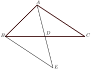

# Auxiliary Lines in Planar Geometry

## Preface

Proving a proposition in planar geometry is like hiking -- to find a path from the starting point (the problem) to the destination (the conclusion). Yet the path can be a broad highway, or a meandering trail, or -- you may even find yourself in front of a river. 

The auxiliary lines are the bridges to get you across. Such lines are indispensible in many problems, or can drastically simplify the proof in others. Just like there are no universal rules on where or how to build the bridge for all kinds of terrains, the auxiliary lines have to be designed based on individual problems. Difficult as it can be for beginners, the process to analyze the problem and find the solution is rigorous, creative, interesting and extremely rewarding. This booklet is intended to give you a helping hand.

## Basic problems

In $\triangle ABC$, $AD$ is a median. $DE$ extends $AD$ and $DE = AD$. Show that $BE \| AC$ and $BE = AC$.

